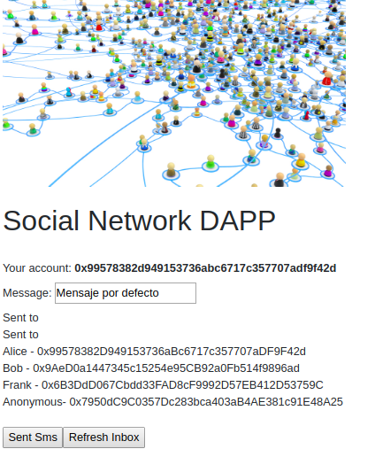
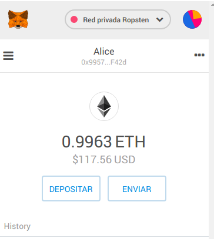
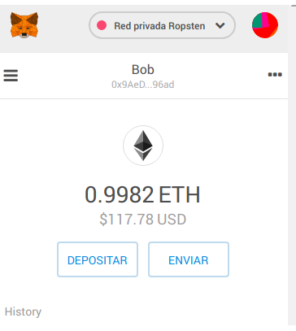
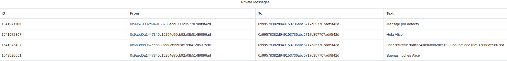
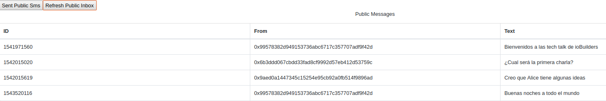

## Table of Contents
- [What is this](#what-is-this)
- [How work](#how-work)
- [Smart contract](#smart-contract)
- [Requirements](#requirements)
- [Start dapp](#start-dapp)
- [Check dapp](#check-dapp)
- [React references](#references)
- [Contact](#contact)

## What is this
This is a simple descentralized application that allow send messages inside a social network
- There are public message: All members of social network see these messages
- There are private message: All members of social network see these messages

## How-work
- Metamask manage your private keys
- Smart contract store your messages
- Dapp push `message` to IPFS (Interplanetary file system). It generate a hash to represent this `message`
- For *public* messages: It store the above hash in smart contract
- For *private* messages: The hash is encrypt with receiver public key. Then it only can be read/decrypted by the receiver. 
- It is encrypted with `ethereum key pair`
- It is using a common [eth-crypto](https://github.com/pubkey/eth-crypto#encryptwithpublickey) library







## Smart-Contract
- This smart contract is deployed [TestNet Ropsten blockchain](https://ropsten.etherscan.io/)
- Here, you can [check all transactions](https://ropsten.etherscan.io/address/0x79b26b495e46632f4097b7f057306fd8ae47c6f2) related with it

## Requirements
- You need a ipfs node deployed in localhost. For get it, i suggest start deploying a docker container of [ipfs/go-ipfs](https://hub.docker.com/r/ipfs/go-ipfs/) 
- Also you need a browser with [metamask](https://metamask.io/) (it will be responsible of manage and protect your credentials). I recommend install [metamask chrome extension](https://chrome.google.com/webstore/detail/metamask/nkbihfbeogaeaoehlefnkodbefgpgknn)
 - The dapp is ready to work with specific accounts (Bob, Alice, Frank and Anonymous). You must adapt dapp to your own  Ropsten accounts
 - For custom your account, you only need change two things.
   - Update `const options` with specific addresses
   - Update `accounts.js` with map for all your accounts like key:value. Where key is address account and value is public key account

## Start-dapp
 - Start ipfs-host
 ```
 docker run -d --name ipfs_host -v $ipfs_staging:/export -v $ipfs_data:/data/ipfs -p 4001:4001 -p 127.0.0.1:8080:8080 -p 127.0.0.1:5002:5001 ipfs/go-ipfs:latest
```
 - Start dapp with `yarn start`

## Check-dapp
- Open two browser with metamask installed
- If you have trouble with cors. I suggest start chrome browser with disable web security

```
google-chrome --disable-web-security --user-data-dir=/home/miguel/chrome-profile/alice
google-chrome --disable-web-security --user-data-dir=/home/miguel/chrome-profile/bob
```

## References
This project was bootstrapped with [Create React App](https://github.com/facebook/create-react-app).

Below you will find some information on how to perform common tasks.<br>
You can find the most recent version of this guide [here](https://github.com/facebook/create-react-app/blob/master/packages/react-scripts/template/README.md).

## Contact
If you need help, propose enhancement or ask whatever you could contact with me by email. I reply you as soon as posible
- miguelgomezcuesta@gmail.com